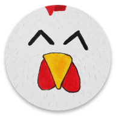

# Snegg 

A free Snake clone for Android with hand-drawn graphics by Benjamin Kan (former Benjamin Sautermeister) and Vanessa Kan. The game is powered by [LibGDX](https://libgdx.com/), and this project's main purpose was to learn that cross-platform Java game development framework by example.

    

You can download the game from [Google Play Store](https://play.google.com/store/apps/details?id=de.bsautermeister.snegg).

### Features
- Online leaderboards and achievements

## Acknowledgements

Thanks to Scott Holmes for allowing us to use this his song in our non-commercial game. The song is free to use under [FREE Creative Commons License](https://scottholmesmusic.com/licensing/).

## License

This work is published under [MIT][mit] License.

[mit]: https://github.com/b3nk4n/snegg-game/blob/main/LICENSE
